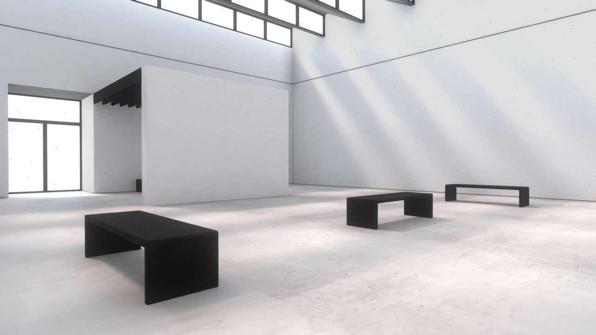

# DirectX12 활용 3D 미술관 관람

## Project Docent - 3D 전시관 뷰어 (DirectX 12)
직접 만든 3D 전시관에 모바일 사진을 실시간으로 걸어주는 렌더러

### 소개
Project Docent의 뷰어는 상용 엔진 없이 DirectX 12로 직접 만든 3D 전시관입니다.

모바일 앱이 네트워크로 보내는 사진과 설명을 실시간으로 받아 전시관 액자에 걸어줍니다. 사용자는 전시관 안을 자유롭게 걸어 다니며 작품을 감상하고 액자를 옮겨 나만의 전시를 꾸밉니다.

### 핵심 경험
1. 전시관을 둘러봅니다. 직접 만든 전시관 안을 걸어 다니며 벽에 걸린 액자들을 감상합니다.

2. 사진이 실시간으로 걸립니다. 모바일에서 전송한 사진이 곧바로 액자에 나타납니다.

3. 작품 해설을 읽습니다. 각 액자를 선택하면 작품 설명을 팝업으로 보여줍니다.

4. 전시를 꾸밉니다. 액자를 집어 옮기거나 배치를 바꿔 나만의 전시 공간을 만듭니다.

(이미지: 모바일에서 전송한 사진이 액자에 뜨는 전후 비교 컷)

### 주요 기능
실시간 사진 수신 전시
모바일에서 보낸 사진을 받아 전시관 액자에 실시간으로 띄웁니다. 사진이 전송되는 순간과 전시되는 순간이 곧바로 이어집니다.

도슨트 해설 시스템
사진과 함께 받은 작품 설명을 액자에 붙입니다. 전시관에서 액자를 선택하면 해당 작품의 해설을 팝업으로 보여줍니다.

3D 전시관 탐험
전시관 안을 자유롭게 걸어 다닙니다. 벽 충돌 처리로 공간 밖으로 나가지 않으며 원하는 액자 앞으로 이동해 감상합니다.

작품 큐레이션
마우스로 액자를 집어 원하는 위치로 옮기거나 두 액자의 배치를 서로 교체합니다. 세부 위치와 각도를 조정해 나만의 방식으로 전시를 구성합니다.

### 기술 스택
| 구분 | 내용 |
|------|------|
| 언어 | C++ |
| 그래픽스 | DirectX 12 기반 자작 렌더러 |
| 모델 로딩 | Assimp |
| 이미지 처리 | Windows Imaging Component |
| UI | Dear ImGui |
| 네트워크 | Winsock 기반 TCP 소켓 서버 |

### 조작법
- W A S D : 전시관 이동
- 마우스 드래그 (빈 공간) : 카메라 시선 회전
- 마우스 드래그 (액자) : 액자 이동
- UI 패널 : 배치 교체 및 위치 조정 및 도슨트 가이드 열기

### 실행 방법
- 이 뷰어는 서버 역할을 하므로 모바일 앱보다 먼저 실행합니다
- 실행하면 네트워크 연결을 기다립니다
- 모바일 앱이 접속하면 사진과 설명을 받아 액자에 표시합니다

리소스는 실행 파일 기준 상대 경로로 로드되며 빌드 후 자동 복사되어 별도 설정 없이 실행됩니다.